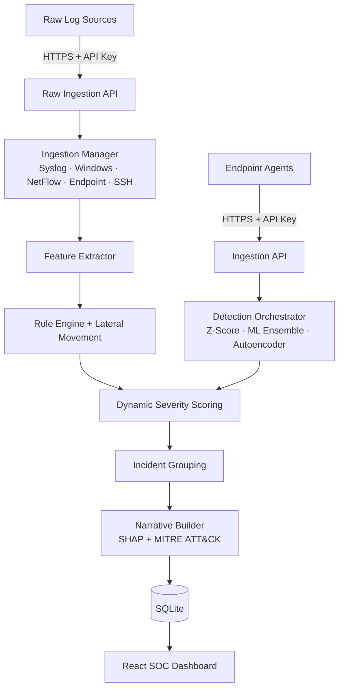

<div align="center">

# 🛡️ LSADRA

### Local Security Anomaly Detection & Risk Assessment — open-source, explainable, built to run anywhere.

**Real-time, multi-source log detection with ML ensembles, SHAP explainability, and human-readable threat narratives — no LLM API keys required.**

<br/>

[](LICENSE)
[](https://www.python.org/)
[](https://fastapi.tiangolo.com/)
[](frontend/)
[](tests/test_v4_smoke.py)
[](tests/security/)
[](https://github.com/tsmanral/lsadra/actions/workflows/ci.yml)
[](https://github.com/tsmanral/lsadra/stargazers)

</div>

---

## Why LSADRA?

Enterprise SIEMs like Splunk and Microsoft Sentinel are powerful — and heavy, expensive, and opaque. Lightweight consumer tools watch the network but have no real detection intelligence. **LSADRA fills the gap**: a self-hostable SOC platform that explains *why* every alert fired.

- 🧠 **Multi-layer ML detection** — statistical baselining (Z-score), ensemble models (Isolation Forest, LOF, One-Class SVM), and a PyTorch autoencoder, with drift tracking via Population Stability Index.
- 🔍 **Explainable by design** — SHAP feature attribution, composite severity scoring with a plain-English breakdown per alert, and MITRE ATT&CK technique mapping with confidence scores.
- 🌐 **Multi-source ingestion** — parsers for SSH auth logs, Syslog, Windows Events, network flows (NetFlow / firewall), and endpoint telemetry through a single raw-log API.
- 📖 **Threat narratives without an LLM** — a pure-template case-file generator turns correlated anomalies into readable incident stories. Zero API keys, zero recurring cost.
- 🚨 **Detection rules that matter** — brute force, credential stuffing, port scans, exfiltration, LOLBin abuse, persistence, and lateral movement, all with tunable thresholds and analyst feedback loops.
- 📊 **Full SOC dashboard** — modern React (Vite) command center with live threat feed, incident drill-down, multi-source health, threat intel (AbuseIPDB), model analytics, device behavior, feedback & threshold tuning, and admin management with RBAC + JWT auth. A legacy Streamlit interface is also included.

## Quick Start

> Requires **Python 3.12 or newer**. CI pins 3.12; the test suite also runs clean on 3.14. Check installed versions with `py -0` on Windows.

```bash
# 1. Clone and set up
git clone https://github.com/tsmanral/lsadra.git
cd lsadra
py -3.12 -m venv venv            # Linux/macOS: python3.12 -m venv venv
venv/Scripts/pip install -r requirements.txt   # Linux/macOS: venv/bin/pip

# 2. Start the API server (creates the database on first launch)
venv/Scripts/python -m uvicorn server:app --host 0.0.0.0 --port 8000

# 3. In a second terminal, start the React dashboard
cd frontend
npm install
npm run dev
```

Open **http://localhost:5173**, register an account, and connect your first device from the **Connect Device** page — it generates a one-line install command for any Linux host. The Linux agent auto-detects whether the system uses `/var/log/auth.log` or `journalctl`. On Windows, `python windows_agent_simulator.py` spins up a local test agent.

To validate the full pipeline (parsers, rules, severity, narratives, DB, scheduler):

```bash
venv/Scripts/python tests/test_v4_smoke.py    # expected: 27/27 passed
```

### Docker (production)

```bash
cp .env.example .env    # set JWT secrets, TLS flags, optional AbuseIPDB key
docker compose up -d
```

This starts the API (`:8000`), the legacy Streamlit dashboard (`:8501`), and an idle agent simulator. A versioned Docker image is also published to [GHCR](https://github.com/tsmanral/lsadra/pkgs/container/lsadra) on every release.

## Ingesting Logs

Any log line from any source, through one endpoint:

```bash
curl -X POST http://localhost:8000/api/events/raw \
  -H "Content-Type: application/json" \
  -H "X-Device-Id: <device-id>" -H "X-Api-Key: <api-key>" \
  -d '{"lines": [{"raw_line": "Jan  5 12:34:56 server sudo[999]: root : COMMAND=/bin/bash", "source_hint": "syslog"}]}'
```

Per-source ingestion health is available at `GET /api/events/stats`.

## Architecture



A deeper technical walkthrough lives in [ARCHITECTURE.md](ARCHITECTURE.md), and the platform's design evolution is documented in [docs/V3_VS_V4_EVOLUTION.md](docs/V3_VS_V4_EVOLUTION.md).

Background jobs (APScheduler) handle cross-source correlation, lateral-movement scans, metrics pre-aggregation, geo-resolution, threat-intel caching, drift detection, and data retention — no external queue or cron required.

**Today** the stack is Python end to end: a FastAPI core (ingestion, detection, storage, orchestration), a React + Vite SOC dashboard, and a thin Python endpoint agent.

**Planned:** the endpoint agent is being replaced by **Rust collectors** — small static binaries (target: <15 MB RSS) that read the OS log source, batch, and ship over HTTPS with disk spooling across outages. The Python core keeps the ML and explainability work, where its ecosystem is the reason to stay. The two sides are bound by a versioned contract, [`docs/contracts/event-schema.v1.json`](docs/contracts/event-schema.v1.json), rather than shared code — see [ADR 0001](docs/architecture/adr/0001-rust-collector-split.md) for the reasoning.

## Project Structure

```
lsadra/             Core platform: auth, ingestion, detection, storage, scheduler, legacy UI
frontend/           React (Vite + TypeScript) SOC dashboard
tests/              Test suite + end-to-end smoke tests
  security/         Security regression suite — one file per remediated finding
demo/               Labeled synthetic demo corpus (JSONL) + scenario documentation
  corpus/           ssh_bruteforce · persistence_new_service · data_movement_offhours · benign_background
scripts/            Operator tooling (seed_demo.py — replays the demo corpus through the real API)
docs/               Documentation tree
  architecture/adr/ Architecture Decision Records
  contracts/        event-schema.v1.json — the versioned collector ↔ core event contract
  threat-models/    Threat models (product, agent-key custody, prompt injection)
datasets/           Synthetic SSH log generator for local experimentation
.github/workflows/  CI matrix, DCO, release, security scanning, Discord notifications
fleet_simulator.py  Multi-device fleet traffic simulator
windows_agent_simulator.py  All-in-one Windows test agent
windows_live_agent.py       Live Windows event agent
server.py           FastAPI entry point
```

## Contributing

Contributions are welcome! Read the [Contributing Guide](CONTRIBUTING.md) for the development setup, coding standards, and pull-request process. The short version:

1. **Fork** the repo and create a feature branch from `main` (`git checkout -b feature/my-improvement`).
2. Make your change and run both gates:
   ```bash
   python tests/test_v4_smoke.py     # expect 27/27
   python -m pytest tests/security/  # expect 0 failures
   ```
3. Sign off your commits (`git commit -s`) — this project uses the [DCO](https://developercertificate.org/), enforced in CI.
4. Open a **pull request** against `main` with a clear description.

`main` is protected and the only long-lived branch — **everything lands through a pull request**, including maintainer work. Every PR runs the full CI matrix (Ubuntu, Windows, macOS), a lint pass, secret scanning, and the DCO check. Bug reports and feature ideas are welcome in [Issues](https://github.com/tsmanral/lsadra/issues).

Changes to user-facing behavior, environment variables, endpoints, or project structure must update this README **in the same PR** — the PR template has a checkbox for it.

This project follows the [Contributor Covenant Code of Conduct](CODE_OF_CONDUCT.md).

## Security

LSADRA treats logs as **attacker-controlled input** — they reach parsers, the detection pipeline, and (later) an LLM and a RAG index. The threat model is written down in [`docs/threat-models/`](docs/threat-models/).

- **Reporting a vulnerability:** use [private vulnerability reporting](https://github.com/tsmanral/lsadra/security/advisories/new) on this repo, or follow the [Security Policy](SECURITY.md). **Never open a public issue for a security finding.** Acknowledgement within 72 hours, triage within 7 days.
- **Regression suite:** every remediated finding is pinned by a test in [`tests/security/`](tests/security/) — 44 tests, run on every PR across all three platforms. A fix without a regression test is not considered done.
- **Supply chain:** secret scanning on every PR diff plus a weekly full-history scan, Dependabot for pip/npm/Actions, and signed release artifacts from M5 onward.

## License

Distributed under the **GNU Affero General Public License v3.0**. See [LICENSE](LICENSE) for details.

## Project Status

[](https://github.com/tsmanral/lsadra/releases)
[](https://github.com/tsmanral/lsadra/commits/main)
[](https://github.com/tsmanral/lsadra/graphs/commit-activity)
[](https://github.com/tsmanral/lsadra/issues)
[](https://github.com/tsmanral/lsadra)
[](https://github.com/tsmanral/lsadra/pkgs/container/lsadra)

**Current release: v5.0.0.** Active development. This section is kept current — if it disagrees with the code, the code is right and the README is a bug.

**Where the project is now**

- **Security remediation complete.** Every finding from two rounds of automated security review is fixed, and each one is pinned by a regression test — 44 tests in [`tests/security/`](tests/security/). Two items remain deferred by design: WebSocket handshake authentication (lands with the async core) and signed agent distribution (lands with release engineering).
- **CI on every PR:** pytest across Ubuntu, Windows, and macOS, plus lint, secret scanning, and a DCO check. A weekly job re-scans full history for secrets.
- **PR-only workflow.** `main` is protected; all work — maintainer included — lands through reviewed pull requests.
- **Distribution:** GitHub Releases and a container image at `ghcr.io/tsmanral/lsadra`.
- **Demo mode:** a labeled synthetic corpus in [`demo/`](demo/) plus [`scripts/seed_demo.py`](scripts/seed_demo.py), which replays it through the real ingestion API so a fresh install has something to look at. All demo data is obviously synthetic by construction (`demo-host-NN` hostnames, `.demo` users, RFC 5737/3849 documentation IP ranges).

**What's next (M1 — async core)**

- Async ingestion on aiosqlite + WAL with worker queues, retention lifecycle, and DuckDB analytics
- A **benchmark harness** — the throughput target has to be measured, not asserted
- Authenticated `/ws/alerts` WebSocket handshake
- Prompt-injection defense: logs are attacker-controlled input, and they reach the LLM and RAG index
- Freezing event schema v1 as the collector contract

Follow [Releases](https://github.com/tsmanral/lsadra/releases) for progress, or the [ADRs](docs/architecture/adr/) for the reasoning behind the larger calls.

## Author

**Tribhuwan Singh**

[](https://github.com/tsmanral)
[](https://www.linkedin.com/in/singhtribh/)
[](https://tsmanral.github.io/)
[](mailto:tribhuwan.singh1108@gmail.com)

## Contributors

Thanks to everyone who has contributed to LSADRA:

<a href="https://github.com/tsmanral/lsadra/graphs/contributors">
  
</a>

---

<div align="center">
⭐ If LSADRA is useful to you, consider starring the repo — it helps the project reach more people.
</div>
